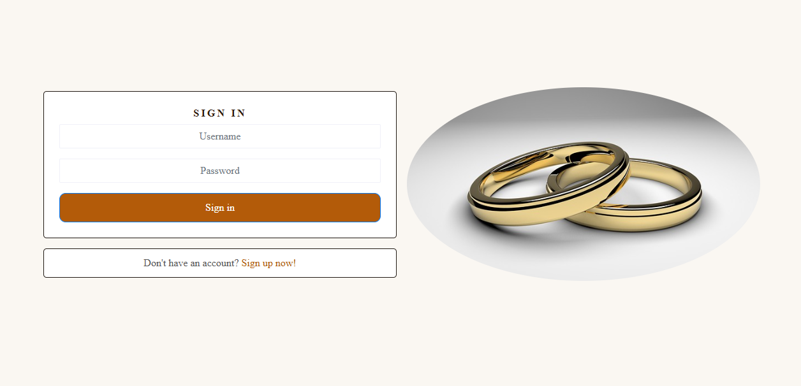

# Lobola Insurance

Lobola is traditional Southern African custom in which a man pays a bride price--usually in the form of cattle or money--to the family of the woman he wishes to marry. It is practiced in several cultures. This site hopes to help many people from going into debt or borrowing money to pay lobola. Insurance helps reduce the financial risk and provides peace of mind during a culturally important but expensive process. The site is mainly targeting people who wish to marry and yet can't afford. The site does not only offer insurance, but also a platform where members can share content of their Lobola events, other members can read, and comment on the content shared. This insurance app is not only targeted at South Africans, but the world as it keeps diversing. There are people who go into multiracial marriages, due to traveling a lot. So when people learn about customs and cultures of South Africa, then they will find this insurance app useful.

## Features Frontend

### Navigation Bar
*

### Sign In Page

### Sign Up Page

### Features Left To Implement
* When a user clicks on the "Get a Quote" button, they should be redirected to a Coverage plans page where they can select the type of plan they want to get for their ceremony.
* The "Learn more" button should redirect a user to a page where they can learn more about the app.
* Create terms and conditions regarding payouts
* On the Home Page, I would like to add more details regarding the insurance I offer

## Testing

### Manual Testing Frontend
* When a user tries to submit an empty signin/signup form, the form is defensive. Users have to complete all fields. Please see image below:

### Validator Testing

### Unfixed Bugs

* When I access the app, before I signin or click any button I get the below errors on dev tools. The default profile image is not readable. Please see image below:

## Deployement

## Credits

### Content
* Sarah, a Tutor of CI, helped me with the sign out link. I could not sign out once signed in, and Sarah helped me find my way to fixing the issue.
* I have issues with the URLS. A couple of tutors tried to help me position the URL's at the right places namely: Rebecca, Sarah, Roman
* Oisin, a Tutor of CI, helped me with getting my workspaces set up as I was struggling with the commands given to set it up.
* The Moments Walkthrough helped me set up my workspaces and also with the content.

### Media
* The images used on this app are taken from various sites: ChatGPT, [Pixabay]https://pixabay.com/images/search/cow%20with%20rings%20%20logo/
* The logo image used is taken from [ChatGPT]https://chatgpt.com/s/m_6821d556cde88191b13fd8483534c194

