# Lobola Insurance
## Objective
Lobola is traditional Southern African custom in which a man pays a bride price--usually in the form of cattle or money--to the family of the woman he wishes to marry. It is practiced in several cultures. This site hopes to help many people from going into debt or borrowing money to pay lobola. Insurance helps reduce the financial risk and provides peace of mind during a culturally important but expensive process. The site is mainly targeting people who wish to marry and yet can't afford. The site does not only offer insurance, but also a platform where members can share content of their Lobola events, other members can read, and comment on the content shared. This insurance app is not only targeted at South Africans, but the world as it keeps diversing. There are people who go into multiracial marriages, due to traveling a lot. So when people learn about customs and cultures of South Africa, then they will find this insurance app useful.

## Features Backend - Django REST Framework

I created an Application Programming Interface (API) using Django REST Framework which allows users to store and manipulate data records, to register and log in to the application without issues.

### Root Route
- When a user is not logged in, the root route page appears showing a welcome message. Please see below:

### Profile List
- This page shows the list of profiles created
- Anyone can view this part of page. No login required
- At this stage, no user can temper with the profiles created. Please see below:

### Post List
- This page shows the number of posts posted by the users. Please see below:

- Happy, a logged in user, can create a post using the form provided
- They can choose an image they would like to post, however the images should fit the required criteria of 2MB
- If the image is large, a 403 error message will appear but that will not break the site
- Please see image below:

### Comment List
- This page shows the number of comments and also shows the comments given
- Also, unauthorised users cannot comment on posts. Please see below:

- A logged in user is able to select a post they would like to comment in
- The below HTML form allows the user to write what they have in mind about the post. Please see below:

### Follower List
- This page shows the number of followers on the users list. Please see below:

- An authenticated user is able to click on the dropdown button on the form to select a user they would like to follow. Please see below:

### Like List
- This page reflects the number of likes each post received. Please see below:

- When a user is logged in, they are able to like other users posts.
- At the bottom of the page, there is a form where an authenticated user can click on the dropdown button to choose a post to like
- Users cannot like their own posts. Please see image below:

### Testing Backend
#### Validator testing - Python test
- The settings page had lines that were too long to pass the test. Please see below:

- After fixing them, the CI Python Linter test passed. Please see below:

#### Python testing
#### Post Views
A.  
- I tested if the Posts can be listed. 
- The first test failed due to incorrect status code. Please see below:

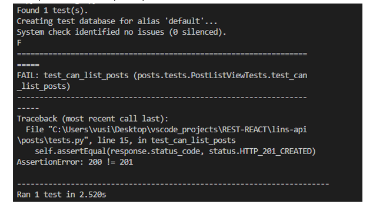

A.1 
- After fixing the status code from 201 to HTTP_200_OK, the test passed. Please see below:

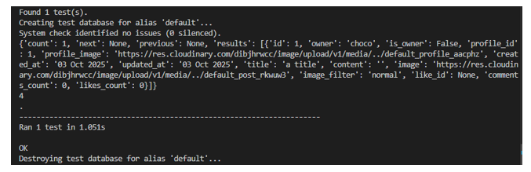

B. 
- I tested to see if logged in users can create a post. 
- The test failed due to the post not being created, so the database stays empty. Please see below failed test:

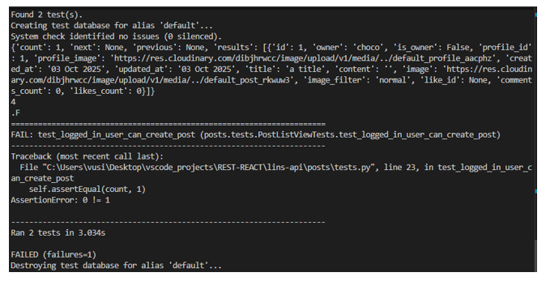

C. 
- I tested to see if user is not logged in they can't create a post.
- The first test failed to incorrect status code.
- The test expected status code HTTP_401_UNAUTHOIZED, instead found 200_OK which was not correct.
- Please see below snippet:

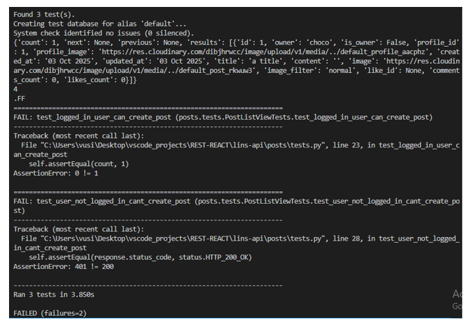

C.1 
- I changed the status code according the AssertionError results.
- The test passed. Please see below:

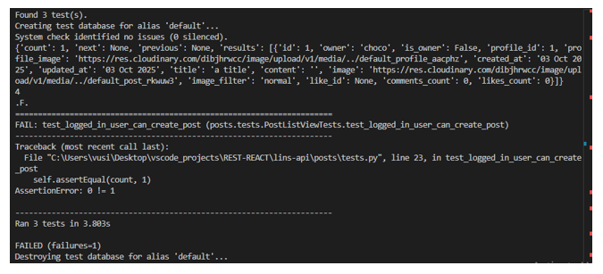

D. 
- I tested if posts can be retrieved using valid id.
- The test failed because of an incorrect status code. Please see below:

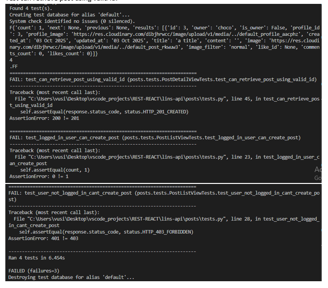

D.1 
- After making the necessary change with the status code, the test passed. Please see below:

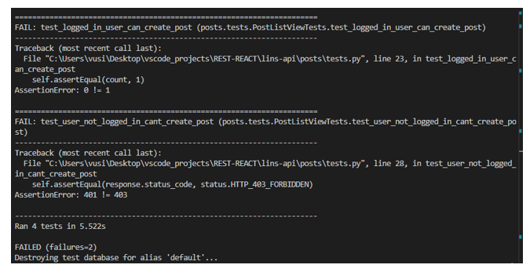

E. 
- I tested if posts can't be retrieved using invalid id.
- The test failed due to incorrect status code. Please see below:

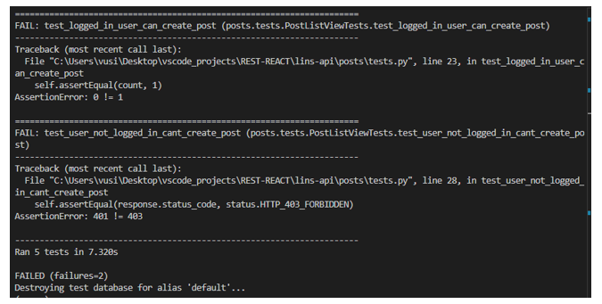

E.1 
- The test passed when I fixed the status code. Please see below:

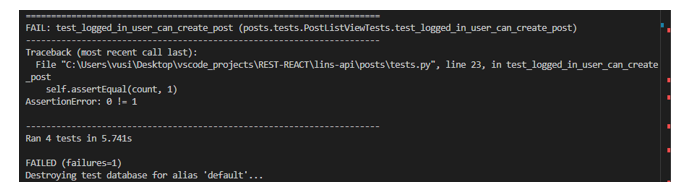

F. 
- I did a test to see if users can update their own posts.
- The test failed due to incorrect status code.
- The test also had an error stating that there is no 'title' object and yet there is.
- The test failed to find or update the post in the database. Please see below:

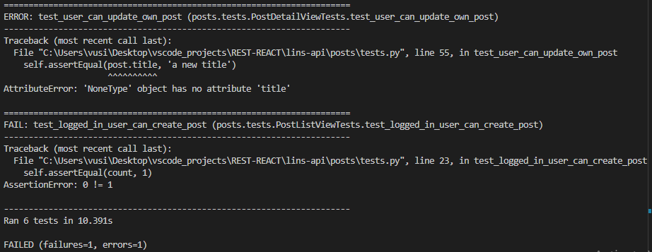

G. 
- I tested to see if user cannot update another user's post.
- The test failed at the beginning due to incorrect status code. Please see below:

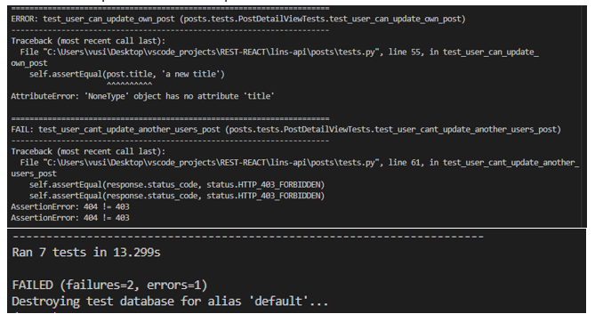

G.1 
- After fixing the status code, the test finally passed. Please see below:

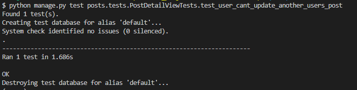

In total, I managed to test 7 functions. Out of the 7 only 6 have passed. 

### Backend Deployement
### PosgreSQL
1. Navigate to PostgreSQL from Code Institute. Enter email address and click submit:

2. Database is successfully created. Please *review the email* sent to your student email inbox:

### Heroku
3. Log into Heroku and go to the *Dashboard*:

4. Click the "New" button:

5. Click "Create new app":

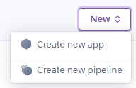

6. Give the app a name and select region. Then click "Create App" to confirm:

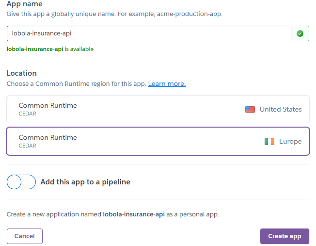

7. Open the *Settings* tab:

8. Scroll down to Config Vars section. Click on the "Reveal Config Vars" button. Add a Config Var key *DATABASE_URL* and value of the database created from PostgreSQL:

### IDE
9. On VSCode, update the *DATABASES* on the settings.py file:

10. On the terminal, migrate database models to new database:

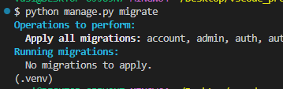

11. Create a superuser for new database:

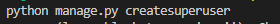

12. Create a Procfile file that will provide the commands to Heroku to build and run the project:

### Heroku
13. On Heroku settings, added two more Config Vars: CLOUDINARY_URL and SECRET_KEY:

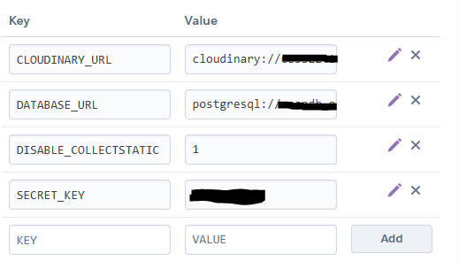

14. Open the *Deploy* tab. Scroll down to *Deployment* method section, select *Connect to GitHub*:

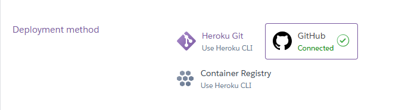

15. When all changes have been pushed to GitHub, use *Manual deploy* section and click *Deploy Branch*. Project will be deployed:

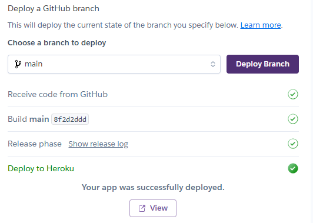

### Creating a new React app in an existing DRF workspace
* How I started a React Project inside the *LINS* project:
    - Inside the workspace, I created a directory called *frontend* in the terminal
    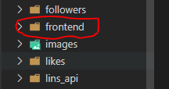
    - From inside the frontend directory, I ran the following command to create a new React app and installed the working dependencies that will be needed
    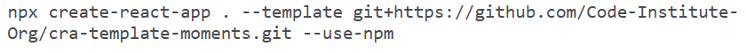
    -  I ran the command *npm start* in the terminal to test functionality
    
    - After determining my local development environment URL, I prepared the environmental variables
    - I updated the settings.py page to with COR variables and ALLOWED_HOST
    - I then prepared React to connect to the Django API by adding proxy url to the package.json file
    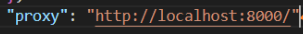
    - As I am combining workspaces, I didn't need to add the BaseURL setting in the axiosDefaults.js file when creating. Reason being, the combined workspace received the JSON from API from same URL.
    - When running the application, I needed to have both Django API and frontend directories running at the same time.
    - First terminal would be the Django API directory, then the second one would be the frontend directory.
    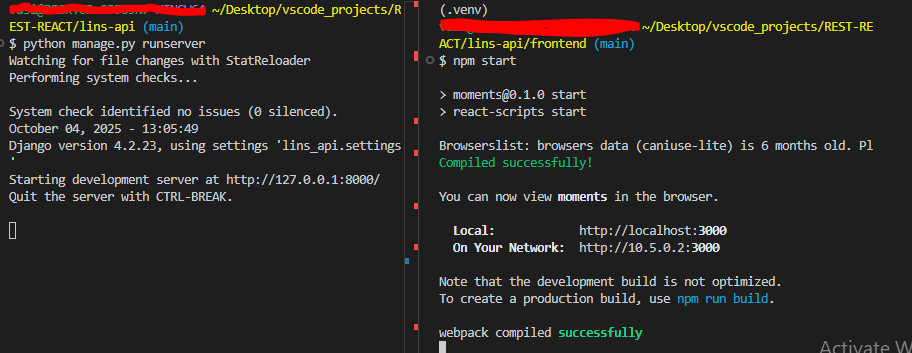

## Features Frontend

### Navigation Bar
- When a user is not yet logged in, the below is what the navigation bar looks like.
- It consists of a logo (a cow's head with Lobola Insurance written on it on a white background)

- When a user is signed in, the navigation bar shows more links/ pages. Please see below:

### The home page
- This includes a photograph of for men (uncles) negotiating the price for the Lobola
- On the the image is a text overlay which attracts the user to browse through the site
- Below the text are two buttons, one to get a quote of the insurance offered, and the other is to learn more about the site. Please see image below:

- When a user clicks the 'Get a Quote' button, they are able to view the quotes we offer. Please see below:

- The 'Learn More' button shows more information about the insurance site. Please see below:

#### How it works section
- Below the landing image is a section that tells user what the insurance offeres
- It is just a brief explanation of what is included. Please see below:

### Add post feature
- A user can upload an image of choice to share their big day.
- A user is able to create posts in order to share with others. Please see below:

### The post page
- Here users are able to view the most recent posts.
- On this page, one  can view the most followed profiles.
- Users are able to like other people's posts and comment on them.
- Users can also follow other profiles.
- Users are able to see our customers in action and see how the insurance had helped them with arranging their lobola and/ weddings. Please see below:

#### Comment section
- A user is able to comment on a post
- They can also edit and delete their comment by clicking the Kebab Menu for the options. Please see below image:

### Profile page
- The profile page shows the number of posts a user has and also the number of followers. Please see below:

### Sign In Page
* A user is then prompted to sign in if the have already been able to signup
* A beautiful image of rings shows what the the user is getting themselves into

### Sign Up Page
* If a user has not signed yet, they can simply signup to be a part of the community. Please see image below:

### Features Left To Implement
* Add buttons to the quote so that users can apply for the insurance.
* Create terms and conditions regarding payouts

## Testing

### Manual Testing Frontend
* When a user tries to submit an empty signin/signup form, the form is defensive. Users have to complete all fields. Please see image below:

* When a user tries to like their own post, a pop message saying: "You can't like your own post!" appears. Please see below:

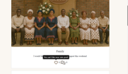

### Validator Testing
- HTML:
    * There appears to be errors on the index.html file.
    * These errors are part of the package and cannot be changed. Please see below:

    

- LIGHTHOUSE:
    * <strong>Django REST Framework:</strong> The profile page is not showing the HTML form, meaning that it is not allowing users to create profiles. Please see results below:

    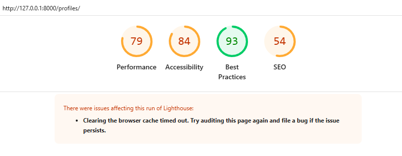

### Unfixed Bugs

* When I access the app, before I signin or click any button I get the below errors on dev tools. The default profile image is not readable. Please see image below:

* <strong>Django REST Framework:</strong> The profile page is not showing the HTML form, meaning that it is not allowing users to create profiles even when authenticated.

## User Stories 
##### Fulfilled User Stories
* <strong>View Profile Page:</strong> This user story is to allow users to view other users profiles. This user story was indeed fulfilled.
* <strong>Edit Posts:</strong> This user story allows users to edit their posts. But another user is restricted from editing another users profile or post.
* <strong>Display Posts Lists:</strong> As a owner, I created a platform for users to display their posts.
* <strong>Create Posts:</strong> Users are able to create posts on the site
* <strong>Navigation Bar:</strong> Users are able to navigate through the navigation bar to get around the site.
* <strong>Authentication:</strong> Users are able to sign up to my site in order to access and navigate through the insurance site
* <strong>View Home Page:</strong> Users won't need to be logged in order to view the homepage. The home page has a callout message for the users.
* <strong>Create Quote Button:</strong> A button is created for users to click on in order to get a quote on the type of insurance that suites them.
* <strong>Click Learn More Button:</strong> On this button a user is able to read more about what the site offers.

##### Unfulfilled User Story
* <strong>Create select quote button:</strong> These buttons were supposed to be active so that a user can select the type of quote they can offer. However, now I have decided to add them on future implementations.

## Deployement
* I followed the Advanced Front End: Deployement of both applications instructions
* The guide assisted in deploying both my React front-end project and my Django API backend as both projects were combined in one workspace.
* Setting up WhiteNoise for static files
* Add route to serve the index template
* Combining both Django and React static files and compiling them
* Add runtime.txt file to ensure Heroku uses the correct version of Python to deploy my project
* Test functionality of the URL
* On the Heroku App, inside Settings, add ALLOWED_HOST and CLIENT_ORIGIN inside Config Vars
* Go to Deploy page and deploy my project.

## Credits

### Acknowledge
* Sarah, a Tutor of CI, helped me with the sign out link. I could not sign out once signed in, and Sarah helped me find my way to fixing the issue.
* I have issues with the URLS. A couple of tutors tried to help me position the URL's at the right places namely: Rebecca, Sarah, Roman
* Oisin, a Tutor of CI, helped me with getting my workspaces set up as I was struggling with the commands given to set it up.
* The Moments Walkthrough helped me set up my workspaces and also with the content.
* My Mentor helped with the fixes on my project and making sure the project is functioning as it should.
* Roman, a tutor at CI, helped with the Avatar image as it was not appearing. 
* I wanted a reminder on how to create handleClick, I got help from [Stackoverflow](https://stackoverflow.com/questions/75640164/react-router-to-redirect-new-page-using-a-button-onclick/75640182)

### Media
* The images used on this app are taken from various sites: ChatGPT, [Pixabay](https://pixabay.com/images/search/cow%20with%20rings%20%20logo/)
* The logo image used is taken from [ChatGPT](https://chatgpt.com/s/m_6821d556cde88191b13fd8483534c194)
* Some of the images were created with ChatGPT to suite the insurance site.

