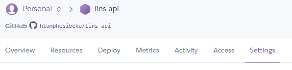
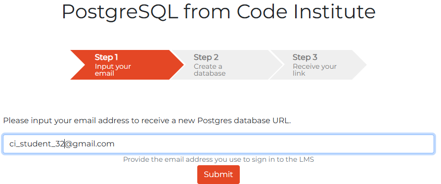

# Lobola Insurance

Lobola is traditional SouthernAfrican custom in which a man pays a bride price--usually in the form of cattle or money--to the family of the woman he wishes to marry. It is practiced in several cultures, including amoung the Zulu, Xhosa, Tswana, and Shona people. This site hopes to help many young men from going into debt or borrowing money to pay lobola. Insurance helps reduce the financial risk and provides peace of mind during a culturally important but expensive process. The site is mainly targeting young men who wish to marry and yet can't afford. The site does not only offer insurance, but also a platform where members can share content of their Lobola events, other members can read, and comment on the content shared.

## Features

### Navigation Bar

### Sign In Page

### Sign Up Page

### Features Left To Implement

## Testing

### Manual Testing

### Validator Testing

### Unfixed Bugs

## Deployement

## Credits

### Content
* Sarah, a Tutor of CI, helped me with the sign out link. I could not sign out once signed in, and Sarah helped me find my way to fixing the issue.
* I have issues with the URLS. A couple of tutors tried to help me position the URL's at the right places namely: Rebecca, Sarah, Roman
* Oisin, a Tutor of CI, helped me with getting my workspaces set up as I was struggling with the commands given to set it up.
* The Moments Walkthrough helped me set up my workspaces and also with the content.

### Media
* The images used on this app are taken from various sites: ChatGPT, [Pixabay]https://pixabay.com/images/search/cow%20with%20rings%20%20logo/
* The logo image used is taken from [ChatGPT]https://chatgpt.com/s/m_6821d556cde88191b13fd8483534c194

